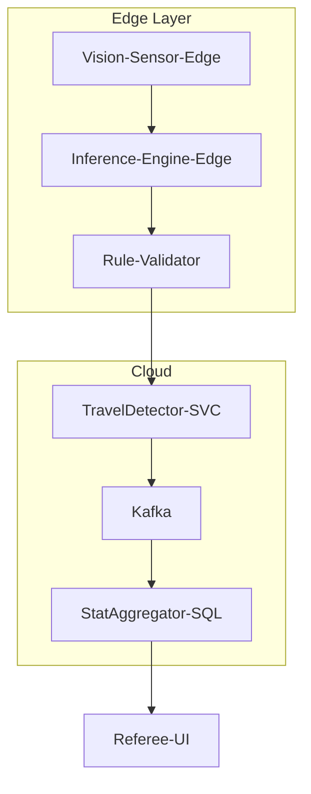

# 篮球 AI 裁判系统 - 微服务架构设计

本文档为篮球 AI 裁判系统设计的微服务架构分层结构与精简版 PRD 文档，结合行业标准架构与技术要点，确保命名规范性与工程可实施性。

## 📋 目录

- [一、系统分层架构（微服务设计）](#一系统分层架构微服务设计)
  - [1. 数据感知层](#1-数据感知层)
  - [2. 边缘计算层](#2-边缘计算层)
  - [3. AI智能体层](#3-ai智能体层)
  - [4. 用户交互层](#4-用户交互层)
- [二、精简版 PRD 文档（敏捷格式）](#二精简版-prd-文档敏捷格式)
- [三、关键设计依据](#三关键设计依据)

---

## 一、系统分层架构（微服务设计）

### 1. 数据感知层

| 微服务名称 | 核心职责 | 技术实现 |
|-----------|----------|----------|
| **Vision-Sensor-Edge** | 多源数据采集：8K摄像头视频流、IMU传感器数据、音频信号 | 基于RTSP协议的视频流处理；蓝牙5.0传感器数据传输 |
| **Data-Preprocessor** | 数据清洗与增强：视频去抖动、传感器数据对齐、音频降噪 | OpenCV + 时序数据对齐算法 |

### 2. 边缘计算层

| 微服务名称 | 核心职责 | 技术实现 |
|-----------|----------|----------|
| **Inference-Engine-Edge** | 实时目标检测与跟踪：球员/篮球/篮筐定位、运动轨迹分析 | YOLOv8模型量化部署（TensorRT加速），DeepSORT跟踪 |
| **Rule-Validator** | 违例预判：走步/双运/出界等规则匹配 | 基于FIBA规则的有限状态机（FSM） |

### 3. AI智能体层

#### 🏀 裁判Agent微服务群

| 微服务名称 | 核心职责 | 技术实现 |
|-----------|----------|----------|
| **TravelDetector-SVC** | 走步检测：融合球轨迹抛物线拟合与步数计数 | 抛物线顶点触地算法 + 加速度计步数检测 |
| **FoulRecognizer-3DPose** | 犯规识别：基于3D姿态估计的推人/打手行为分析 | MediaPipe改进模型 + LSTM时序分析 |
| **Penalty-Decision** | 判罚决策：生成哨声指令与LED屏显示内容 | 置信度阈值决策（>95%自动吹哨） |

#### 🏃‍♂️ 教练Agent微服务群

| 微服务名称 | 核心职责 | 技术实现 |
|-----------|----------|----------|
| **TacticsPlanner-DNN** | 战术推荐：实时攻防策略生成（如挡拆建议） | 图神经网络（GNN）模拟对手阵型 |
| **FatigueMonitor-IMU** | 球员疲劳预警：基于动作幅度下降率与心率数据 | 随机森林分类器 |

#### 🎬 剪辑师Agent微服务群

| 微服务名称 | 核心职责 | 技术实现 |
|-----------|----------|----------|
| **HighlightCutter-LSTM** | 精彩片段截取：自动识别扣篮/三分等高光时刻 | 时序动作检测模型（TSN） |
| **ReplaySelector-MultiCam** | 多视角回放合成：自动选择最佳视角片段 | 多摄像头视域融合算法 |

#### 📊 数据Agent微服务群

| 微服务名称 | 核心职责 | 技术实现 |
|-----------|----------|----------|
| **StatAggregator-SQL** | 实时数据统计：得分/篮板/抢断等指标聚合 | PostgreSQL时序数据库 |
| **ShotChartBuilder-GIS** | 投篮热力图生成：球员投篮位置分布可视化 | 空间坐标映射 + Matplotlib渲染 |

### 4. 用户交互层

| 微服务名称 | 核心职责 | 技术实现 |
|-----------|----------|----------|
| **Referee-UI** | 裁判控制台：显示违例类型/置信度/回放视频 | Qt框架 + YOLOv8检测结果可视化 |
| **Coach-Dashboard** | 教练战术板：实时展示阵型分析与换人建议 | WebSocket数据推送 + D3.js可视化 |

---

## 二、精简版 PRD 文档（敏捷格式）

### 1. 项目概述

**目标**：构建低延迟（判决延迟<300ms）、高精度（目标检测mAP@0.5 > 0.92）的AI裁判系统，覆盖走步检测、战术分析、集锦生成等场景。

**核心指标**：
- **实时性**：视频处理帧率 ≥ 60fps
- **准确性**：走步识别率 > 95%（测试集）
- **可用性**：系统SLA ≥ 99.9%

### 2. 架构设计要点

**技术栈**：

| 模块 | 选型 | 理由 |
|------|------|------|
| 目标检测 | YOLOv8s | 轻量化模型，满足实时边缘推理需求 |
| 数据存储 | TimescaleDB | 优化时序数据（如球员轨迹）查询效率 |
| 消息队列 | Apache Kafka | 支持10万+/秒的传感器数据吞吐 |
| 部署平台 | Kubernetes on Edge | 边缘节点自动扩缩容（响应流量峰值） |

### 3. 微服务接口规范

#### 裁判Agent服务接口

```http
POST /travel-detection
```

**Request:**
```json
{
  "video_frame": "base64",
  "imu_data": [x, y, z]
}
```

**Response:**
```json
{
  "is_travel": bool,
  "confidence": float
}
```

#### 数据Agent服务接口

```http
GET /shot-chart
```

**Response:**
```json
{
  "heatmap": "png",
  "hot_zone_percentage": float
}
```

### 4. 部署视图



### 5. 里程碑计划

| 迭代 | 目标 | 交付物 | 周期 |
|------|------|--------|------|
| **迭代1** | 走步检测MVP | TravelDetector-SVC微服务 + 测试报告 | 2周 |
| **迭代2** | 裁判/教练Agent基础功能 | 战术推荐API + 裁判控制台UI原型 | 3周 |
| **迭代3** | 全链路集成与压力测试 | SLA达标报告 + 部署手册 | 4周 |

---

## 三、关键设计依据

### 🎯 核心算法

1. **走步检测算法**：采用抛物线拟合球轨迹与自定义步数计数器，解决苹果手表计步延迟问题

2. **性能优化**：通过模型量化（FP16精度）与TensorRT加速，边缘推理延迟降低至50ms

3. **容错机制**：当AI置信度<80%时，触发Human-Override接口交由人工裁判裁决

### 📐 架构原则

此方案严格遵循微服务单一职责原则（如TravelDetector仅处理走步），并通过Kafka实现服务解耦。

---

## 📚 参考资料

- **完整架构设计文档模板**：[参考链接待补充]
- **PRD协作建议**：推荐使用ONES平台管理

---

*该文档持续更新中，如有问题请联系开发团队。*